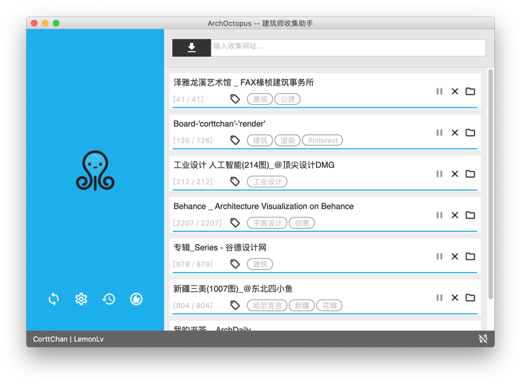
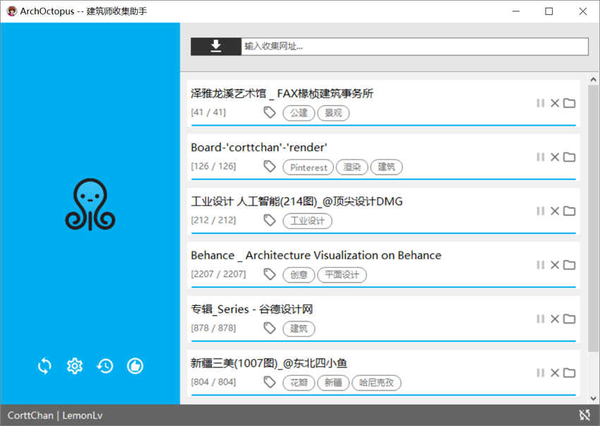
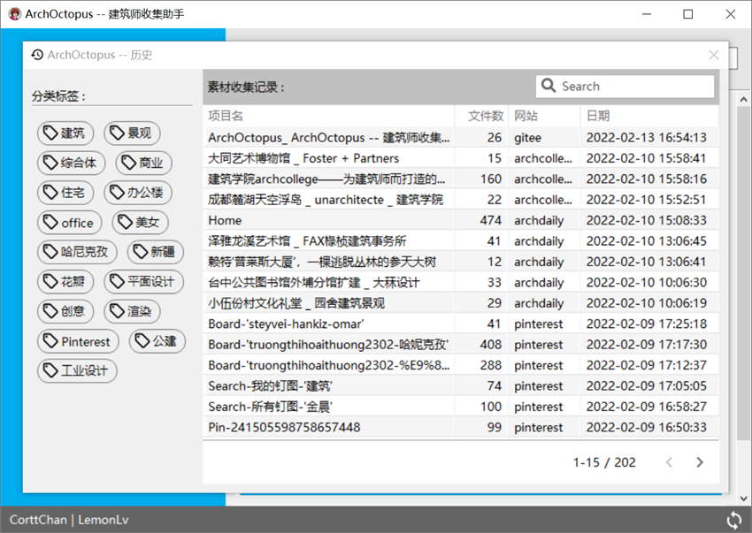
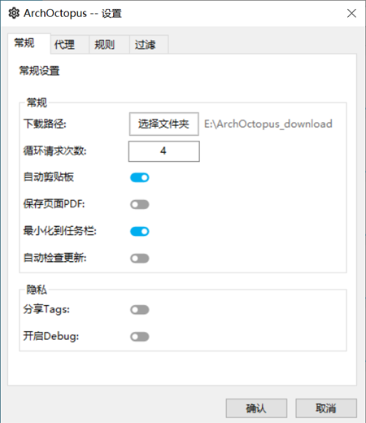
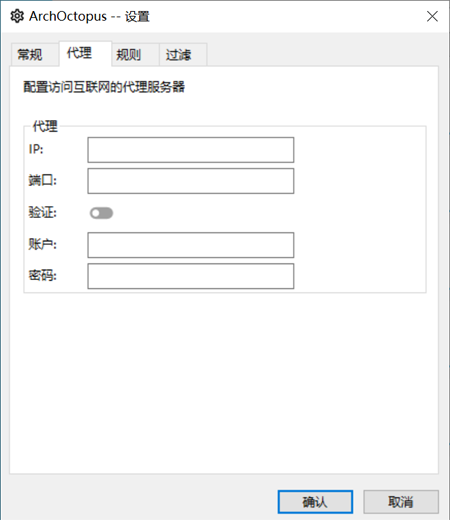
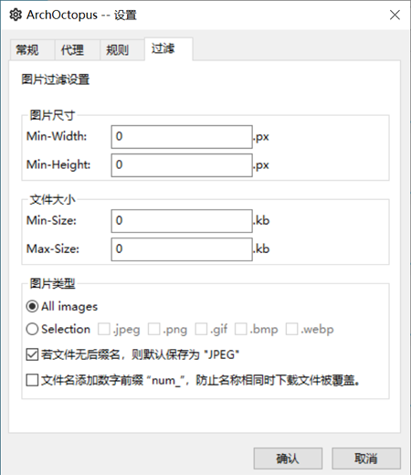

# ArchOctopus -- 建筑师收集助手
#### ArchOctopus: 以设计师群体为目标,简单快速收集设计素材的批量下载工具.

<!-- PROJECT SHIELDS -->
[](https://github.com/CorttChan/ArchOctopus/blob/main/LICENSE)
[](https://github.com/CorttChan/ArchOctopus/issues)
[](https://github.com/CorttChan/ArchOctopus/network)
[](https://github.com/CorttChan/ArchOctopus/stargazers)
[](https://github.com/CorttChan/ArchOctopus/releases/latest)
[](https://github.com/CorttChan/ArchOctopus/releases/latest)


## 主要功能:
1. 简洁的用户界面, 方便的多任务管理
2. 图片过滤(图片尺寸,文件大小,图片类型)
3. 自动读取本机浏览器cookies,无需密码登录
4. 网络代理
5. 账户同步(目前支持的网站: Archdaily, Huaban, Pinterest)
6. 历史查找与分类标签
7. 自动化剪贴板
8. 可自定义规则插件系统
9. 插件自动在线更新
10. 支持Mac和Win

## 简介
ArchOctopus的编写始于2016年底，由Python语言编写而成，命名来源于一张可爱的[章鱼动图](https://dribbble.com/shots/1808172-Octopus-ish-guy-Swim-Cycle/attachments/8990689?mode=media)。

本程序的编写起源于日常工作中用来快速收集一些设计参考图片的需要。  
本人是在上海工作的建筑师，设计工作经常需要收集各类建筑设计类的素材资料。
但是在网络上找寻需要的设计资料和图片极其消磨大量时间，渐渐萌生出写代码脚本来帮助完成的想法。
起初是一些简单的爬虫脚本,后来单个脚本越来越多,为了维护与管理方便,业余时间用wxpython写了GUI界面统一管理.发布过打包版本,但是v1版本写的非常粗糙.

陆续用了一年多,终于在这个春节假期期间重构了这个程序.

V2.0.0开源版本添加了更多的功能,其中最重要是将爬虫的解析作为插件形式独立出来,具备灵活的扩展性.这样既可以根据自己的需要写一些自用的插件,而且在网站页面改变后可以方便的在线更新插件.


愿ArchOctopus能帮助到有同样需求的建筑师。

## 安装与运行
### 安装包运行
- [Window](https://github.com/CorttChan/ArchOctopus/releases/latest)
- [MacOS](https://github.com/CorttChan/ArchOctopus/releases/latest)

### 源码运行
1. python版本 >= 3.6
2. 建立虚拟环境并安装第三方依赖库
```commandline
python3 -m venv venv
venv\Scripts\activate
pip install requirements
```
3. 运行程序
```commandline
python3 main.py
```

## 演示












## 如何编写自己的解析插件
1. example: <site_donate_name.py>
```commandline
# name: site_donate_name.py
# author: xxx
# version: 0.0.1
# date: xxx
# desc: xxx

from plugins import BaseParser


class Parser(BaseParser):
    def __init__(self, *args, **kwargs):
        super(Parser, self).__init__(*args, **kwargs)
        
        # 指定改解析域名的友好名称,作为该域名的主目录. (可选)
        self.friend_name = "xxx"
    
    # 重写route函数,根据输入的url判定解析规则
    def route(self, *args, **kwargs):
        html = kwargs.get("html")
        response = kwargs.get("response")
        
        # 根据表达式规则或其他规则进行分类解析
        if re.match("/(discovery|follow)/?", url_path):
            name = re.match("/(discovery|follow)/?", url_path).group(1)
            self.task_name = f"{name.capitalize()}"
            return self.call_parse(self.parse_xxx, parse_args, parse_kwargs)
            
        elif ...
        
    def parse_xxx(self, *args, **kwargs)
    
        <your_parse_code>
    
        item_data = {
            # 必要键值 -> item下载url
            "item_url": item_url,
            
            # 可选键值 -> item额外属性
            "name": str,
            "sub_dir": str, 
            "size": (width(int), height(int)),
            "bytes": int,
            "type": str,
            "item_index_reset": bool,
            
            # 中止键值 -> 用于主动中止解析
            "is_abort": True,
            "abort_msg": str
        }
        yield item_data
```
2. 将完成的 <site_donate_name.py> 文件放入'./plugins/'目录中.
3. Done!


## 版本控制
- [2.0.0.0](https://github.com/CorttChan/ArchOctopus/releases/tag/v2.0.0)
- [1.8.4.0](https://github.com/CorttChan/ArchOctopus/releases/tag/v1.8.4.0)

## 作者
[@CorttChan](http://www.cortt.me) - cortt.me@gmail.com

## 版权
Copyright (c) CorttChan. All rights reserved.

Licensed under the [GPL-3.0](LICENSE) license.
