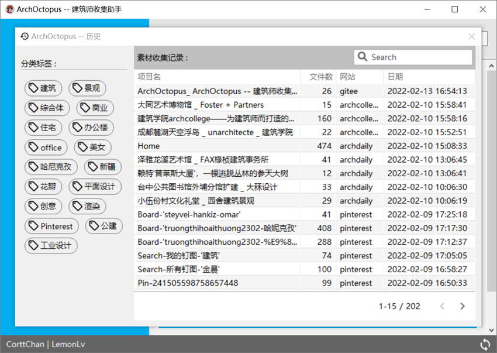

# ArchOctopus -- 建筑师收集助手
#### ArchOctopus 致力于成为快速收集设计素材的通用性工具  

<!-- PROJECT SHIELDS -->
[](https://github.com/CorttChan/ArchOctopus/blob/main/LICENSE)
[](https://github.com/CorttChan/ArchOctopus/issues)
[](https://github.com/CorttChan/ArchOctopus/network)
[](https://github.com/CorttChan/ArchOctopus/stargazers)
[](https://github.com/CorttChan/ArchOctopus/releases/latest)
[](https://github.com/CorttChan/ArchOctopus/releases/latest)


## 主要功能:
1. 简洁的用户界面, 方便的多任务管理
2. 图片过滤(图片尺寸,文件大小,图片类型)
3. 网络代理
4. 账户同步(目前支持的网站: [Archdaily](https://www.archdaily.cn/cn), [Huaban](https://huaban.com/), [Pinterest](https://www.pinterest.com/))
5. 历史查找与分类标签
6. 自动化剪贴板
7. 可自定义规则插件系统
8. 插件自动在线更新

## 简介
ArchOctopus的编写始于2016年底，由Python语言编写而成，命名来源于一张可爱的[章鱼动图](https://dribbble.com/shots/1808172-Octopus-ish-guy-Swim-Cycle/attachments/8990689?mode=media)。

本程序的编写起源于工作上的需要。本人是在上海工作的建筑师，在日常的工作经常需要收集各类建筑设计类的素材资料。但是在网络上找寻需要的设计资料和图片极其消磨大量时间，渐渐萌生出写代码脚本来帮助完成的想法。
从起初Python只是作为辅助工具语言在Grasshopper中写一些自用的电池组件，后来在编写资料设计脚本的过程中越来越喜欢这门语言。

愿ArchOctopus能帮助到有同样需求的建筑师。

## 安装与运行
### 安装包运行
- [Window]()
- [MacOS]()

### 源码运行
1. python版本 >= 3.6
2. 建立虚拟环境并安装第三方依赖库
```commandline
python3 -m venv venv
venv\Scripts\activate
pip install requirements
```
3. 运行程序
```commandline
python3 main.py
```

## 演示





## 如何编写自己的解析插件
1. example: <site_donate_name.py>
```commandline
# name: site_donate_name.py
# author: xxx
# version: 0.0.1
# date: xxx
# desc: xxx

from plugins import BaseParser


class Parser(BaseParser):
    def __init__(self, *args, **kwargs):
        super(Parser, self).__init__(*args, **kwargs)
        
        # 指定改解析域名的友好名称,作为该域名的主目录. (可选)
        self.friend_name = "xxx"
    
    # 重写route函数,根据输入的url判定解析规则
    def route(self, *args, **kwargs):
        html = kwargs.get("html")
        response = kwargs.get("response")
        
        # 根据表达式规则或其他规则进行分类解析
        if re.match("/(discovery|follow)/?", url_path):
            name = re.match("/(discovery|follow)/?", url_path).group(1)
            self.task_name = f"{name.capitalize()}"
            return self.call_parse(self.parse_xxx, parse_args, parse_kwargs)
            
        elif ...
        
    def parse_xxx(self, *args, **kwargs)
        item_data = {
            # 必要键值 -> item下载url
            "item_url": get_pin_url(pin),
            
            # 可选键值 -> item额外属性
            "name": str,
            "sub_dir": str, 
            "size": (width(int), height(int)),
            "bytes": int,
            "type": str,
            "item_index_reset": bool,
            
            # 中止键值 -> 用于主动中止解析
            "is_abort": True,
            "abort_msg": str
        }
        yield item_data
```
2. 将完成的 <site_donate_name.py> 文件放入'./plugins/'目录中.
3. Done!


## 版本控制
- [2.0.0.0]()
- [1.8.4.0]()

## 作者
[@CorttChan](http://www.cortt.me) - cortt.me@gmail.com

## 版权
Copyright (c) CorttChan. All rights reserved.

Licensed under the [MIT](LICENSE) license.
